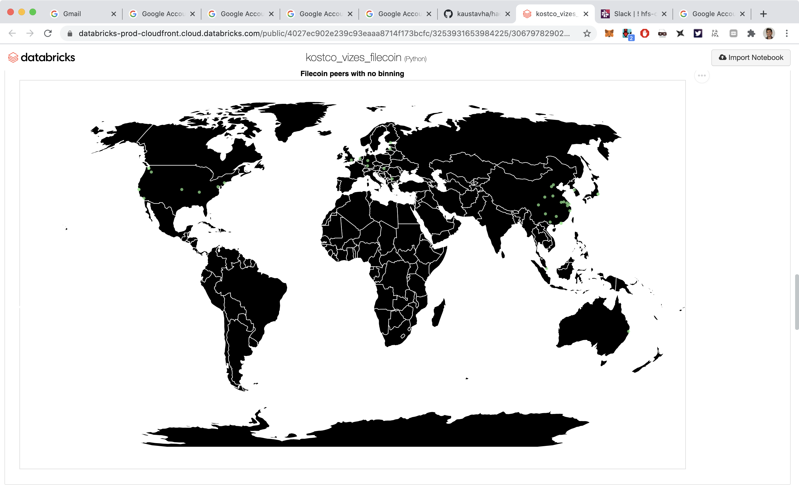
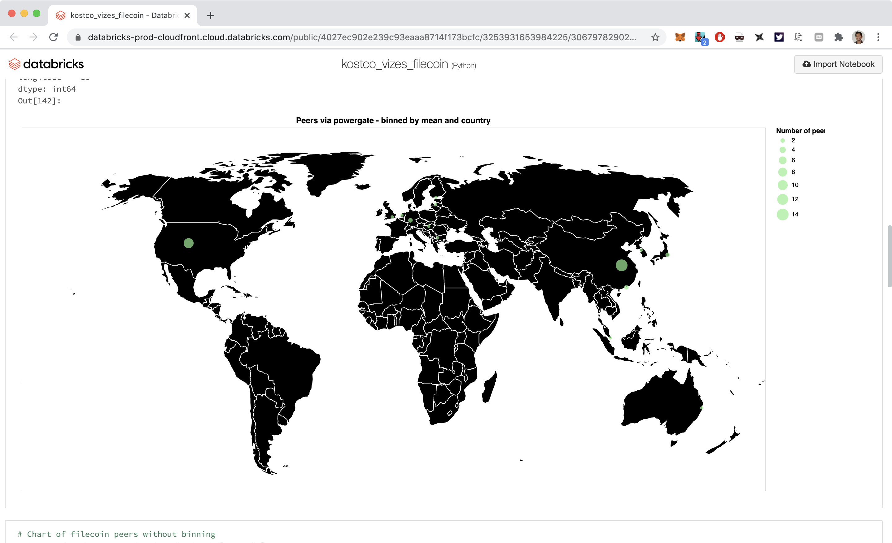

# hackfs-2020
Repo for hackfs 2020 experiments - https://hackfs.com/

# Vizualization / map of the filecoin network overlayed on a world map
- peers.json
This was generated using powergate. A local powergate instance was spun up following: https://gist.github.com/andrewxhill/b0010d555ca4d79d9d1e78e380ad218e#file-index-md
Then the nodejs example app: https://github.com/textileio/js-powergate-client/tree/master/examples/node   
or the cli tool `pow` can be used to retrieve peering info.   

A notebook exists here: https://databricks-prod-cloudfront.cloud.databricks.com/public/4027ec902e239c93eaaa8714f173bcfc/3253931653984225/3067978290237904/6896986926512915/latest.html?fbclid=IwAR1hq0V-w_2UjEBMlioh2ThHAJwKafBWqYUGmjTAAllE2GMTlLDV1FMfBTw  

The notebook contains both a binned and non binned view. 

