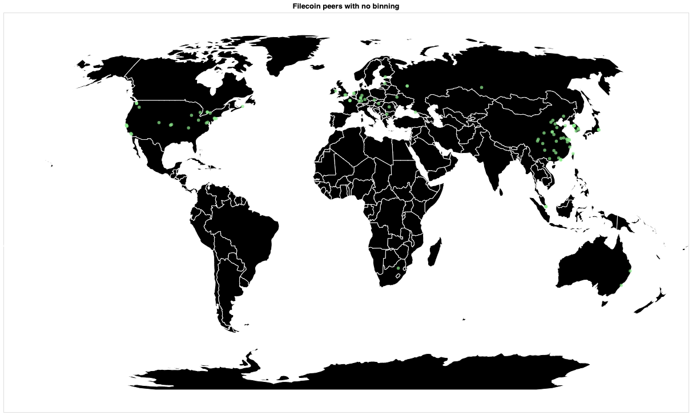
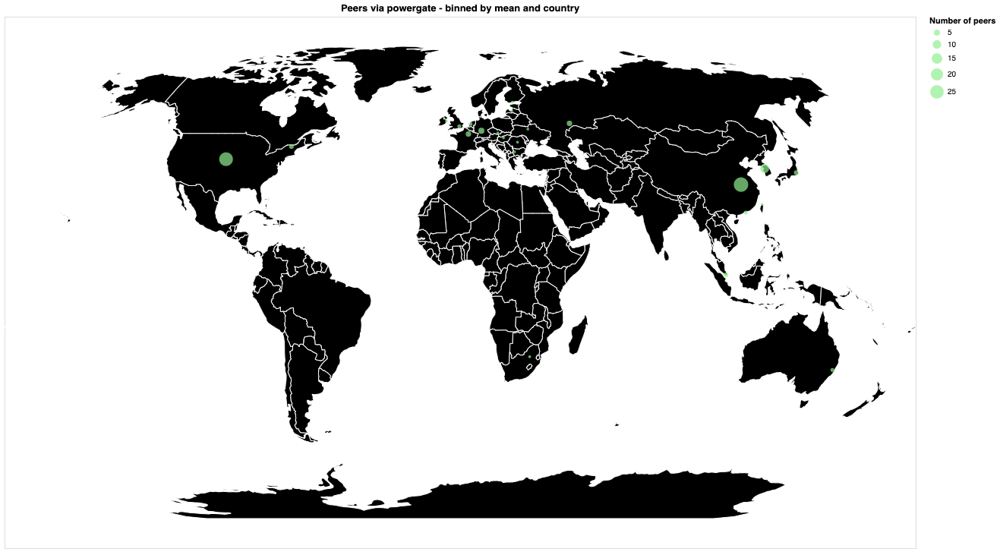
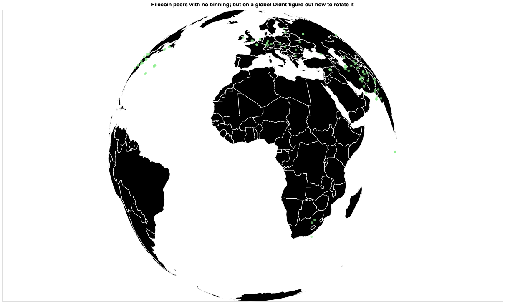
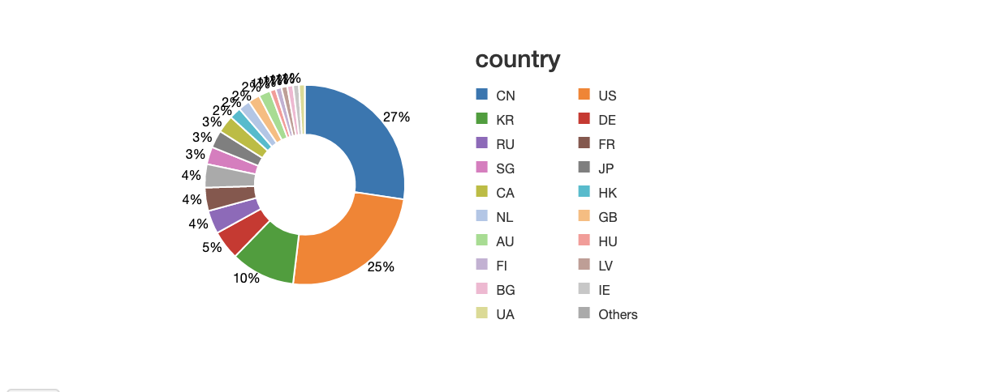

# hackfs-2020
Repo for hackfs 2020 experiments - https://hackfs.com/

# Brief summary
A CLI NodeJS app uses hosted textile powergate to fetch peering information.  
This info is then written, as json, to github, and ipfs via pinata and powergate.  
In a python notebook environment the data is then ETL’d in and visualizations are created.  
The visualizations use a python library called Altair. 

# Notebook:  
[Databricks notebook](https://databricks-prod-cloudfront.cloud.databricks.com/public/4027ec902e239c93eaaa8714f173bcfc/3253931653984225/3067978290237904/6896986926512915/latest.html)

# Quickstart:
- You can run the JS CLI app via:   

```
# install dependencies
npm i

node main.js
```
This will fetch data from a Textile powergate node via the JS client liraries. 
You will either need a locally running node or need to modify the script with a valid remote URL.  


# Vizualization / map of the filecoin network overlayed on a world map
- peers.json
This was generated using powergate. A local powergate instance was spun up following the tutorial [here](https://gist.github.com/andrewxhill/b0010d555ca4d79d9d1e78e380ad218e#file-index-md)    
Then the nodejs example app: https://github.com/textileio/js-powergate-client/tree/master/examples/node   
or the cli tool `pow` can be used to retrieve peering info.    

- The data is then ETL'd into the notebook   

The notebook contains both a binned and non binned view. 

These images from the notebook vizualize the IPFS/Filecoin network via a Textile Powergate node.  







# Basic architecture: 

* A NodeJS CLI application is run on a loop
* This talks to the local or remote powergate client via the textile/powergate-client JS adapter
* It calls the peers API on powergate and writes that to a file in JSON
* This data is then stored for the visualizations. I just used github to store it in an easily accessible manner while prototyping. 
* In the databricks notebook linked there’s some python code that then ETL’s the data from Github or any remote source
* Finally Altair is used to generate the visualizations from the cleaned and merged data-frames
* We generate a map projection using a base vega dataset then plot the peers on it based on latitude and longitude 
* The data is also aggregated via country
* Since Altair generates a vega spec, they can be interactive and can be transformed into HTML5, or pictures
